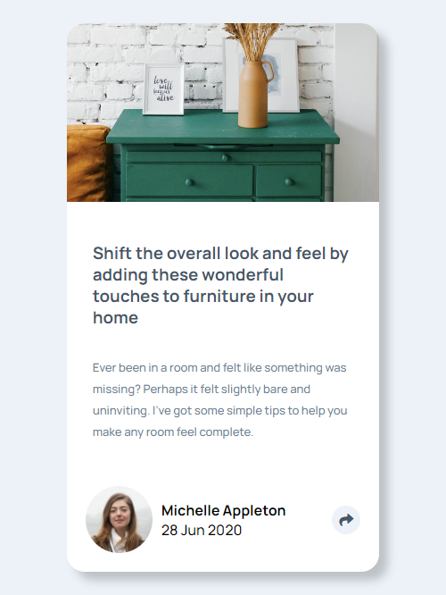
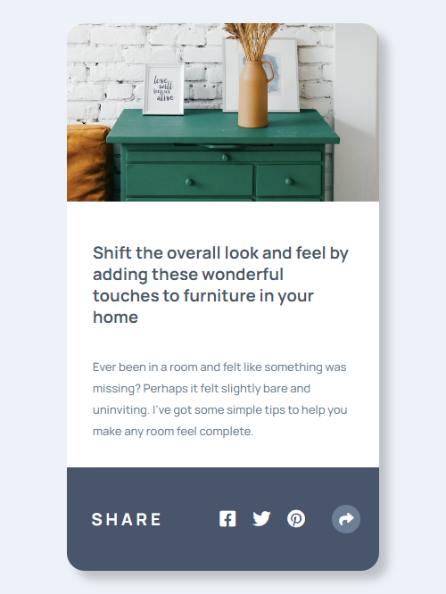
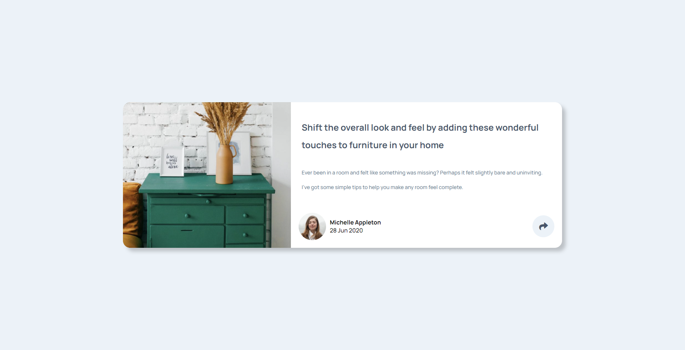
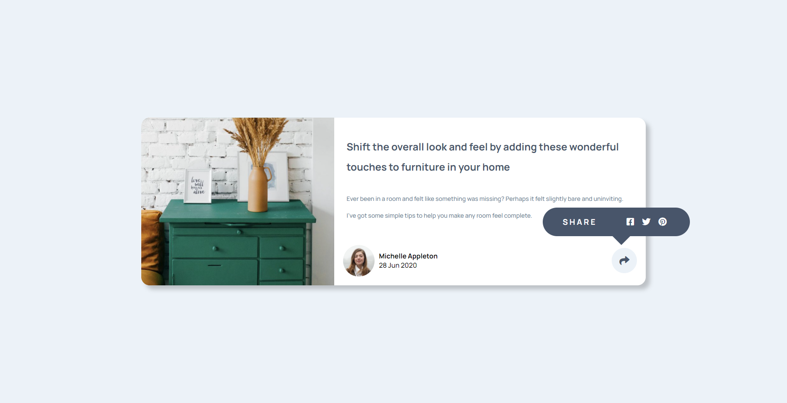

# Frontend Mentor - Article preview component solution

This is a solution to the [Article preview component challenge on Frontend Mentor](https://www.frontendmentor.io/challenges/article-preview-component-dYBN_pYFT). Frontend Mentor challenges help you improve your coding skills by building realistic projects. 

## Table of contents

- [Overview](#overview)
  - [The challenge](#the-challenge)
  - [Screenshot](#screenshot)
  - [Links](#links)
- [My process](#my-process)
  - [Built with](#built-with)
  - [What I learned](#what-i-learned)
  - [Useful resources](#useful-resources)
- [Author](#author)

## Overview

### The challenge

Users should be able to:

- View the optimal layout for the component depending on their device's screen size
- See the social media share links when they click the share icon

### Screenshot

#### Mobile Design

#### Desktop Design

### Links

- Solution URL: [Add solution URL here](https://your-solution-url.com)
- Live Site URL: [Add live site URL here](https://your-live-site-url.com)

## My process

### Built with

- Base HTML5 markup
- SASS
- Flexbox
- Mobile-first workflow
- JavaScript
### What I learned

- I just have learned to use SASS and apply that into this project

### Useful resources

- [SASS Crash Course](https://www.youtube.com/watch?v=Zz6eOVaaelIm) - This SASS Crash Course help me learned basic concept of SASS
- [SASS 2 Hour FreeCodeCamp Course](https://www.youtube.com/watch?v=_a5j7KoflTs&t=697sm) - This Course make me learned more concept about SASS

## Author

- Website - [Tin.Pham](https://github.com/tin-pham)
- Frontend Mentor - [@phambaohuy12345](https://www.frontendmentor.io/profile/phambaohuy12345)
- Facebook - [Tin Pham](https://www.facebook.com/joseph.webdev)*
